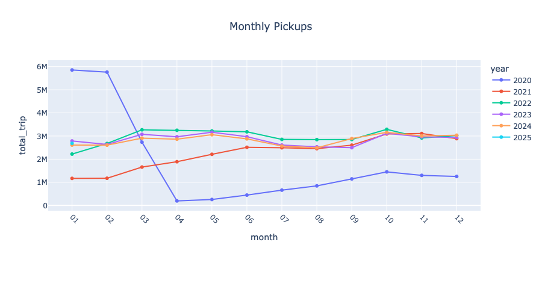
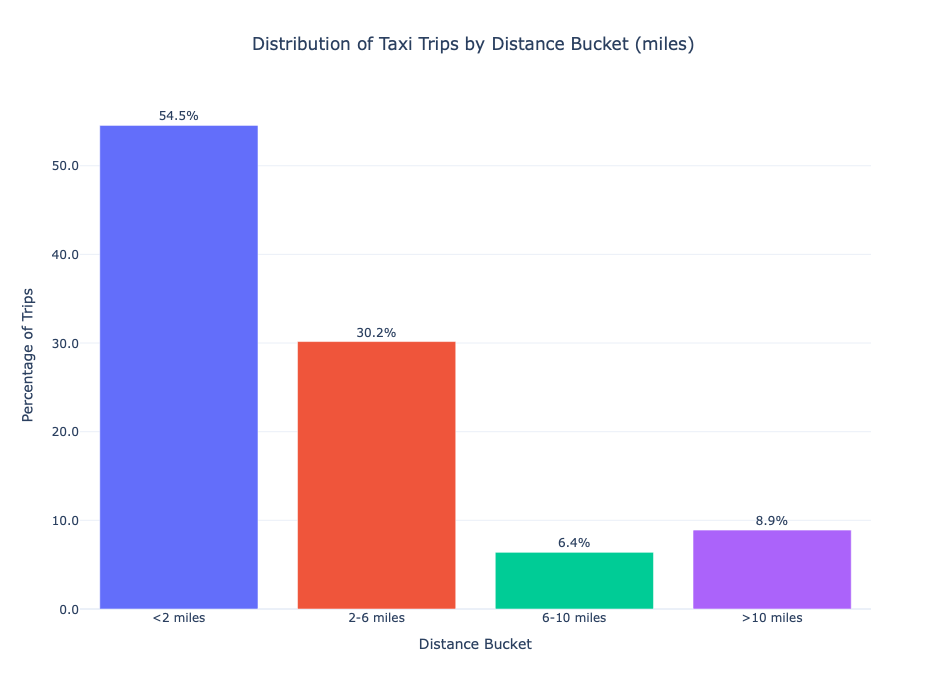
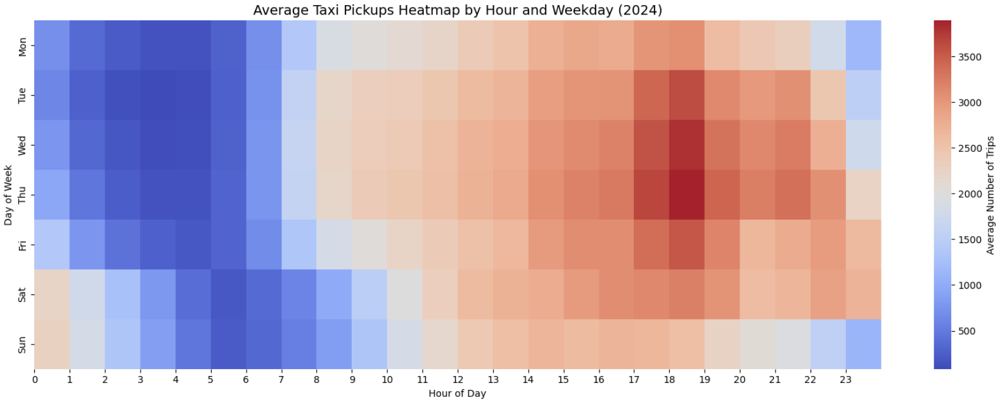
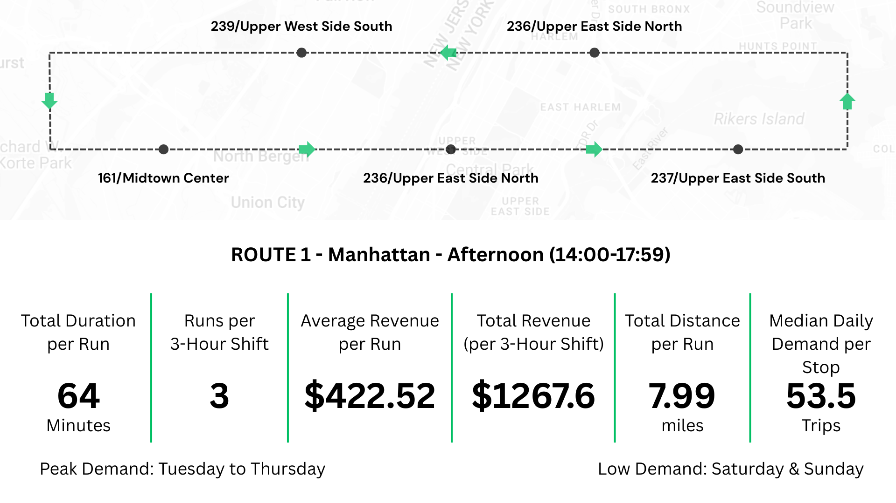

# nyc-taxi-trip-analysis
Processed NYC TLC taxi data with Pandas, NumPy, SQL, and DuckDB — cleaning, transformation, and visualization of trip patterns.

## Overview
This project was developed as the **final project at Rahnema College (Spring 2025)**.  
It analyzes the **NYC TLC Yellow and Green Taxi Trip Records (2020–2025)** using  
**Python, SQL, and DuckDB**. The focus is on **data cleaning, preparation, statistical summaries, and visualization**  
to uncover trip patterns and support data-driven decision making.

> Note: Part of this project was done collaboratively.  

---

## Data Sources
- [NYC TLC Trip Record Data (2020–2025)](https://www.nyc.gov/site/tlc/about/tlc-trip-record-data.page)  
- Taxi Zone Lookup Table (pickup/dropoff zones)  
- NYC Taxi Zone Shapefiles (for geo-visualization)  

---

## Data Preparation
- Cleaned and validated over **183M raw records**.  
- Removed duplicates and irrelevant columns (`VendorID`, `store_and_fwd_flag`).  
- Applied logical filters:  
  - Trip Distance: 0.5–100 miles  
  - Fare Amount: $3–200  
  - Trip Duration: 1–120 minutes  
  - Passenger Count: 1–6  
- Engineered new features (hour, weekday, month, year).  
- Integrated external tables (zone lookup, shapefile, weather).  

---

## Key Findings
- 🚕 **Market Share**: Yellow taxis dominate with ~98% share (vs. 2% green taxis in 2024).  
- 📅 **Weekdays**: Busiest days are Wednesday, Thursday, Friday.  
- ⏰ **Peak Hours**: Evening rush 17:00–19:00.  
- 💳 **Payments**: 85% by credit card, 94.5% at standard rates.  
- 👥 **Trip Patterns**:  
  - 70% under $20  
  - 71% under 20 minutes  
  - 84% under 6 miles  
  - 78% single-passenger  

---

## Geo & Route Analysis
- Manhattan accounts for **88%** of trips, Queens ~10%.  
- Top pickup zones: **JFK Airport, Upper East Side South, Midtown Center**.  
- Top drop-off zones: **Upper East Side North/South, Midtown Center**.  
- **Van-sharing proposal (individual contribution):**  
  - Identified high-demand short routes (1–3 miles, 2–6 passengers).  
  - Designed test scenarios for shared van services during peak hours.  

---

## Visualizations

### 1. Trip Distance Distribution
Most NYC taxi trips are **short-distance**, with over 54% under 2 miles and ~85% under 6 miles.  
This highlights the importance of efficient short-trip management.  

---

### 2. Monthly Pickups (2020–2025)
Trips dropped sharply in early 2020 due to the COVID-19 outbreak, reaching their lowest point in **April 2020**.  
Recovery started around **October 2020**, but even by 2025 trip volumes have **not returned to pre-pandemic levels**.  

---

### 3. Weekly & Hourly Heatmap (2024)
Clear peak demand on **weekdays between 17:00–19:00**, especially Wednesday–Friday.  
Weekends show different late-night patterns due to leisure activities.  

---

### 4. Van-Sharing Proposal – Example Route
One of the proposed shared van routes in Manhattan (Afternoon 14:00–17:59):  

- Avg revenue/run: **$422.5**  
- 3 runs per 3-hour shift → ~$1,267 total  
- Peak demand: Tuesday–Thursday  
- Distance: ~8 miles  

This demonstrates how short, high-demand routes can be optimized with shared vans.  

---